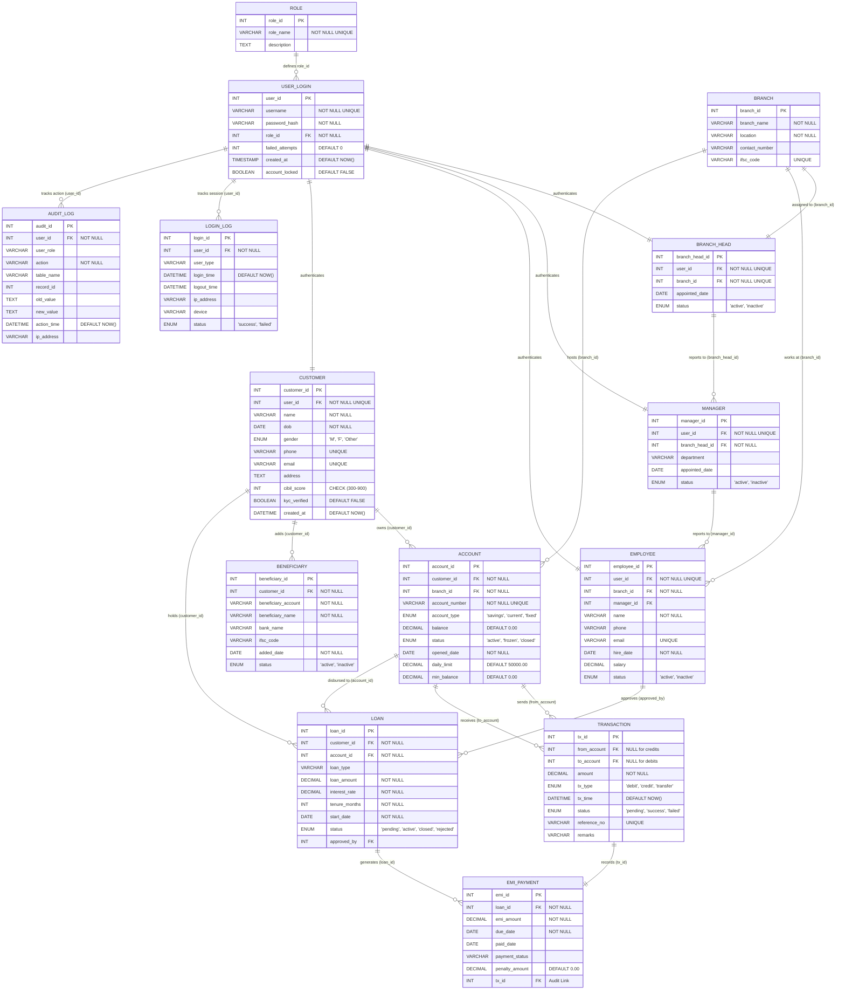

```mermaid
erDiagram
    %% ==========================================
    %% 1. ROLE HIERARCHY & IDENTITY LINKING
    %% ==========================================
    ROLE ||--o{ USER_LOGIN : "defines role_id"
    USER_LOGIN ||--|| BRANCH_HEAD : "authenticates"
    USER_LOGIN ||--|| MANAGER : "authenticates"
    USER_LOGIN ||--|| EMPLOYEE : "authenticates"
    USER_LOGIN ||--|| CUSTOMER : "authenticates"
    
    %% ==========================================
    %% 2. BRANCH & REPORTING STRUCTURE
    %% ==========================================
    BRANCH ||--|| BRANCH_HEAD : "assigned to (branch_id)"
    BRANCH ||--o{ EMPLOYEE : "works at (branch_id)"
    BRANCH ||--o{ ACCOUNT : "hosts (branch_id)"
    
    BRANCH_HEAD ||--o{ MANAGER : "reports to (branch_head_id)"
    MANAGER ||--o{ EMPLOYEE : "reports to (manager_id)"
    
    %% ==========================================
    %% 3. CUSTOMER & BANKING ENTITIES
    %% ==========================================
    CUSTOMER ||--o{ ACCOUNT : "owns (customer_id)"
    CUSTOMER ||--o{ BENEFICIARY : "adds (customer_id)"
    CUSTOMER ||--o{ LOAN : "holds (customer_id)"
    
    %% ==========================================
    %% 4. TRANSACTIONS & LOANS
    %% ==========================================
    ACCOUNT ||--o{ TRANSACTION : "sends (from_account)"
    ACCOUNT ||--o{ TRANSACTION : "receives (to_account)"
    ACCOUNT ||--o{ LOAN : "disbursed to (account_id)"
    
    EMPLOYEE ||--o{ LOAN : "approves (approved_by)"
    LOAN ||--o{ EMI_PAYMENT : "generates (loan_id)"
    TRANSACTION ||--|| EMI_PAYMENT : "records (tx_id)"
    
    %% ==========================================
    %% 5. SECURITY & AUDIT LOGS
    %% ==========================================
    USER_LOGIN ||--o{ LOGIN_LOG : "tracks session (user_id)"
    USER_LOGIN ||--o{ AUDIT_LOG : "tracks action (user_id)"

    %% ==========================================
    %% TABLE DEFINITIONS
    %% ==========================================
    ROLE {
        INT role_id PK
        VARCHAR role_name "NOT NULL UNIQUE"
        TEXT description
    }

    USER_LOGIN {
        INT user_id PK
        VARCHAR username "NOT NULL UNIQUE"
        VARCHAR password_hash "NOT NULL"
        INT role_id FK "NOT NULL"
        INT failed_attempts "DEFAULT 0"
        TIMESTAMP created_at "DEFAULT NOW()"
        BOOLEAN account_locked "DEFAULT FALSE"
    }

    BRANCH {
        INT branch_id PK
        VARCHAR branch_name "NOT NULL"
        VARCHAR location "NOT NULL"
        VARCHAR contact_number
        VARCHAR ifsc_code "UNIQUE"
    }

    BRANCH_HEAD {
        INT branch_head_id PK
        INT user_id FK "NOT NULL UNIQUE"
        INT branch_id FK "NOT NULL UNIQUE"
        DATE appointed_date
        ENUM status "'active', 'inactive'"
    }

    MANAGER {
        INT manager_id PK
        INT user_id FK "NOT NULL UNIQUE"
        INT branch_head_id FK "NOT NULL"
        VARCHAR department
        DATE appointed_date
        ENUM status "'active', 'inactive'"
    }

    EMPLOYEE {
        INT employee_id PK
        INT user_id FK "NOT NULL UNIQUE"
        INT branch_id FK "NOT NULL"
        INT manager_id FK
        VARCHAR name "NOT NULL"
        VARCHAR phone
        VARCHAR email "UNIQUE"
        DATE hire_date "NOT NULL"
        DECIMAL salary
        ENUM status "'active', 'inactive'"
    }

    CUSTOMER {
        INT customer_id PK
        INT user_id FK "NOT NULL UNIQUE"
        VARCHAR name "NOT NULL"
        DATE dob "NOT NULL"
        ENUM gender "'M', 'F', 'Other'"
        VARCHAR phone "UNIQUE"
        VARCHAR email "UNIQUE"
        TEXT address
        INT cibil_score "CHECK (300-900)"
        BOOLEAN kyc_verified "DEFAULT FALSE"
        DATETIME created_at "DEFAULT NOW()"
    }

    ACCOUNT {
        INT account_id PK
        INT customer_id FK "NOT NULL"
        INT branch_id FK "NOT NULL"
        VARCHAR account_number "NOT NULL UNIQUE"
        ENUM account_type "'savings', 'current', 'fixed'"
        DECIMAL balance "DEFAULT 0.00"
        ENUM status "'active', 'frozen', 'closed'"
        DATE opened_date "NOT NULL"
        DECIMAL daily_limit "DEFAULT 50000.00"
        DECIMAL min_balance "DEFAULT 0.00"
    }

    BENEFICIARY {
        INT beneficiary_id PK
        INT customer_id FK "NOT NULL"
        VARCHAR beneficiary_account "NOT NULL"
        VARCHAR beneficiary_name "NOT NULL"
        VARCHAR bank_name
        VARCHAR ifsc_code
        DATE added_date "NOT NULL"
        ENUM status "'active', 'inactive'"
    }

    TRANSACTION {
        INT tx_id PK
        INT from_account FK "NULL for credits"
        INT to_account FK "NULL for debits"
        DECIMAL amount "NOT NULL"
        ENUM tx_type "'debit', 'credit', 'transfer'"
        DATETIME tx_time "DEFAULT NOW()"
        ENUM status "'pending', 'success', 'failed'"
        VARCHAR reference_no "UNIQUE"
        VARCHAR remarks
    }

    LOAN {
        INT loan_id PK
        INT customer_id FK "NOT NULL"
        INT account_id FK "NOT NULL"
        VARCHAR loan_type
        DECIMAL loan_amount "NOT NULL"
        DECIMAL interest_rate "NOT NULL"
        INT tenure_months "NOT NULL"
        DATE start_date "NOT NULL"
        ENUM status "'pending', 'active', 'closed', 'rejected'"
        INT approved_by FK
    }

    EMI_PAYMENT {
        INT emi_id PK
        INT loan_id FK "NOT NULL"
        DECIMAL emi_amount "NOT NULL"
        DATE due_date "NOT NULL"
        DATE paid_date
        VARCHAR payment_status
        DECIMAL penalty_amount "DEFAULT 0.00"
        INT tx_id FK "Audit Link"
    }

    LOGIN_LOG {
        INT login_id PK
        INT user_id FK "NOT NULL"
        VARCHAR user_type
        DATETIME login_time "DEFAULT NOW()"
        DATETIME logout_time
        VARCHAR ip_address
        VARCHAR device
        ENUM status "'success', 'failed'"
    }

    AUDIT_LOG {
        INT audit_id PK
        INT user_id FK "NOT NULL"
        VARCHAR user_role
        VARCHAR action "NOT NULL"
        VARCHAR table_name
        INT record_id
        TEXT old_value
        TEXT new_value
        DATETIME action_time "DEFAULT NOW()"
        VARCHAR ip_address
    }
```
